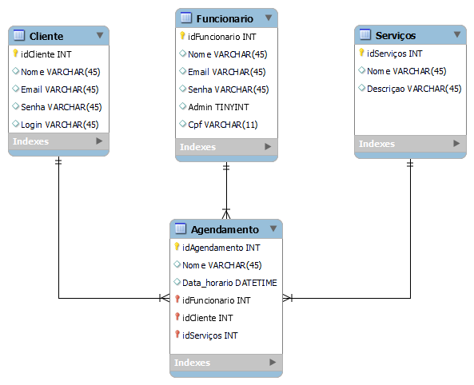

# Black Tatoo

Projeto Final do Curso Técnico Integrado de Desenvolvimento de Sistemas - Colégio Pedro II - Campus Duque de Caxias

**Integrantes:**
 - Maria Luiza Nascimento
 - Vladimir Pinho
 - Yago Silva

 ## Descrição do Projeto

 O Projeto é um programa de agendamento de um estúdio de tatuagem.

 O programa tem como objetivo agendar clientes para fazer tatuagens, os clientes poderão visualizar a galeria do site e escolher as artes de sua preferencia.

## Documentação

- [Manual do Usuário](manual.md)
- [Requisitos](requisitos.md)
- [Casos de Uso](casos-de-uso.md)
- [Apresentação](apresentacao.pdf)

**Diagrama de Classes**

**Modelagem do Banco de Dados**

