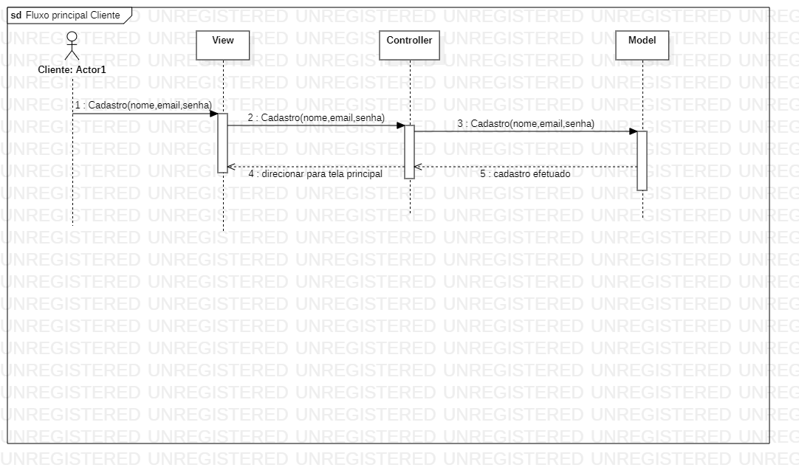
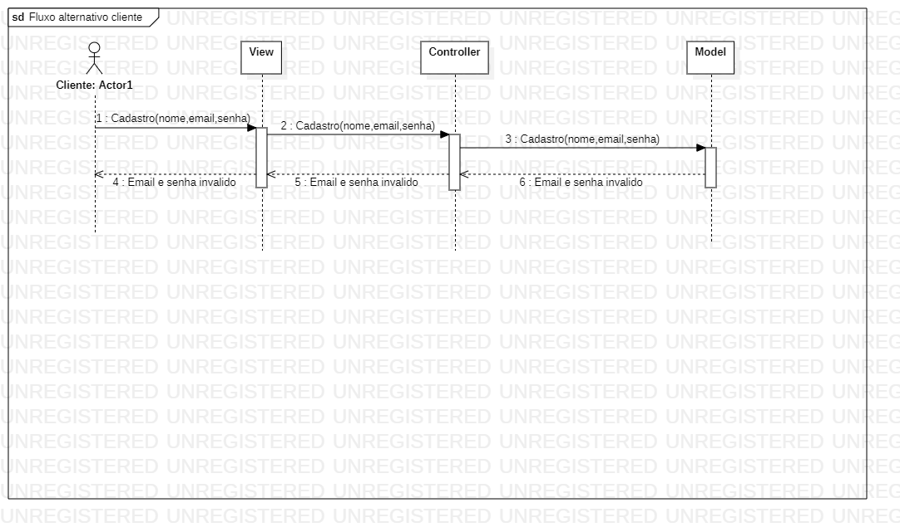
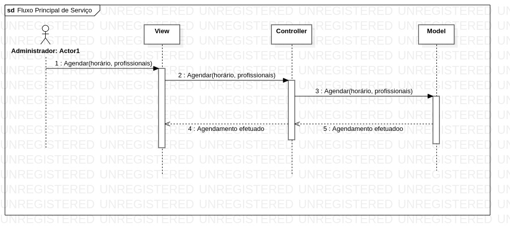
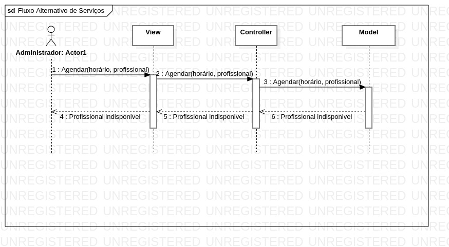
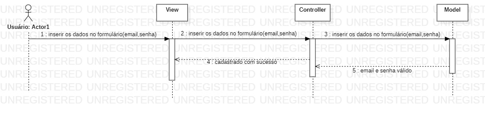
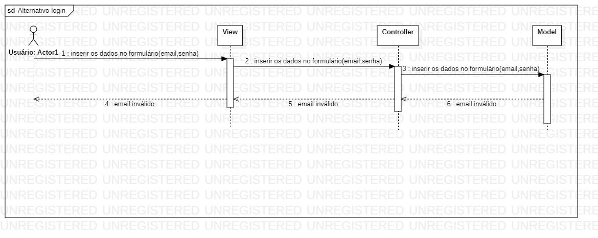
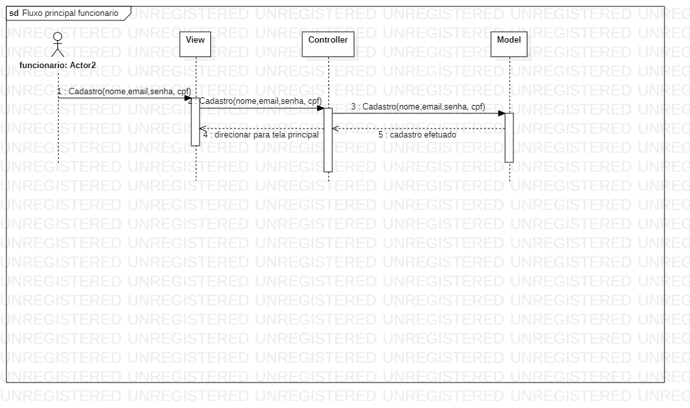
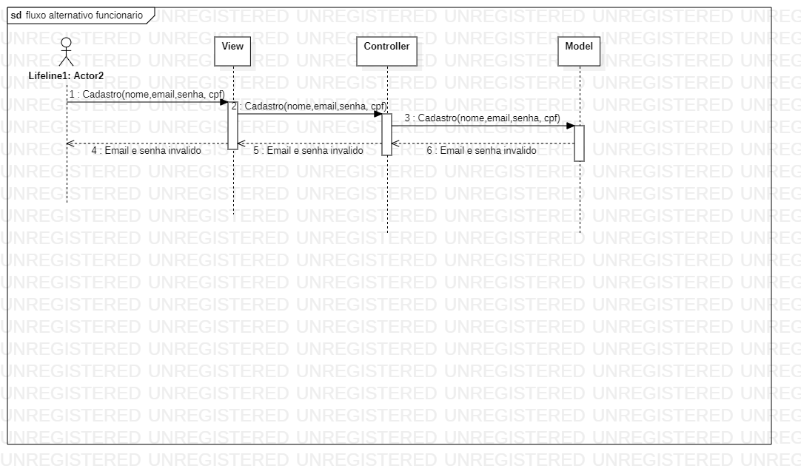

# Documento de Casos de Uso

## Lista dos Casos de Uso

 - [CDU 01](#CDU-01): Cadastrar cliente;
 - [CDU 02](#CDU-02): Cadastro de Serviço;
 - [CDU 03](#CDU-03): Listar clientes cadastrados;
 - [CDU 04](#CDU-04): Visualizar agendamento;
 - [CDU 05](#CDU-05): Cancelar agendamento;
 - [CDU 06](#CDU-06): Excluir cliente;
 - [CDU 07](#CDU-07): Login;
 - [CDU 08](#CDU-08): Adição de Funcionário;
 - [CDU 09](#CDU-09): Disponibilização de horários;
 

 
## Lista dos Atores

 - Cliente;
 - Profissional; 
 - Administrador;

## Diagrama de Casos de Uso

## Descrição dos Casos de Uso

### CDU 01 Cadastrar cliente

**Fluxo Principal**

1. O sistema possuirá uma tela de cadastro com um formulário.
2. O cliente irá inserir os dados no formulário (nome, e-mail e senha).
3. O cliente irá enviar os dados para o sistema clicando no botão "Enviar".
4. O cliente será redirecionado para outra página com o aviso "Cadastro efetuado!". 

**Fluxo Alternativo**

1. O sistema possuirá uma tela de cadastro com um formulário.
2. O cliente irá inserir os dados no formulário (nome, e-mail e senha).
4. O cliente irá enviar os dados para o sistema clicando no botão "Enviar".
5. O sistema informará ao cliente que o email e senha estão inválidos.
6. O cliente digitará corretamente email e senha.
7. O cliente clica em "Enviar".
8. O cliente será redirecionado para outra página com o aviso "Cadastro efetuado!".
 
 
### CDU 02 Cadastro de Serviço

 **Fluxo Principal**

1. O sistema exibirá os horários e os profissionais cadastrados na região do cliente.
2. O cliente irá escolher o horário e profissional de sua preferência. 
3. O cliente irá cilcar em "Agendar".
4. O cliente será redirecionado para outra página com o aviso "Agendamento efetuado!". 

**Fluxo Alternativo**

1. O sistema exibirá os horários e os profissionais cadastrados na região do cliente.
2. O cliente irá escolher o horário e profissional de sua preferência. 
3. O cliente irá clicar em "Agendar".
4. O sistema informará que o profissional não está disponivel.
5. O cliente escolherá outro profissional.
6. O cliente irá clicar em "Agendar".
7. O cliente será redirecionado para outra página com o aviso "Agendamento efetuado!". 
 

### CDU 03 Listar clientes cadastrados

**Fluxo Principal**

1. O administrador possuirá uma interface própria.
2. Nessa interface possuirá um botão "clientes".
3. O administrador clica nesse botão e será redirecionado para outra página.
4. Essa página possuirá todos clientes cadastrados.
5. O administrador poderá excluir cadastros.

**Fluxo Alternativo**

1. O administrador clica no botão "clientes".
2. O administrador seleciona um cliente.
3. O administrador tentará excluir o cadastro.
4. Será exibido a mensagem de que o cadastro foi cancelado.

### CDU 04 Visualizar agendamento

**Fluxo Principal**

1. O administrador e o funcionário poderão ver os agendamentos feitos pelos clientes.
2. Na interface do administrador terá um botão "agendamentos" ao clicar ele será redirecionado para outra página.
3. Essa página terá registros de todos os agendamentos feitos pelo sistema.
4. Na interface do profissional terá um botão "meus agendamentos" ao clicar ele será redirecionado para outra página.
5. Essa página terá as datas e os hórarios que o profissinal terá que atender.

### CDU 05 Cancelar agendamento

**Fluxo Principal**
1. Na interface do administrador terá a página "agendamentos" .
2. Dentro da página "agendamentos" cada agendamento que ainda não teve seu serviço prestado terá o botão "cancelar". 
3. O administrador clicará no botão "cancelar" e uma mensagem "Gostaria de cancelar esse agendamendo?" será exibida.
4. O administrador clicará em "sim" e a mensagem "cancelamento feito com sucesso!!"

### CDU 06 Excluir cliente 

**Fluxo principal**

1. Na interface do administrador terá a página "Clientes".
2. Dentro da página "Clientes" terá o botão "excluir". 
3. O administrador clicará no botão "excluir" e uma mensagem de "Gostaria de excluir esse cliente?" será exibida.
4. O administrador clicará em "sim" e excluirá o cliente. 

**Fluxo alternativo**

1. Na interface do administrador terá a página "Clientes".
2. Dentro da página "Clientes" terá o botão "excluir". 
3. O administrador clicará no botão "excluir" e uma mensagem de "Gostaria de excluir esse cliente?" será exibida.
4. O administrador clicará em "não" e não excluirá o cliente. 

### CDU 07 Login

**Fluxo Principal**

1. O sistema exibirá a página inicial do programa.
2. O cliente clica em "Login".
3. O cliente será redirecionado para a página de login.
4. Será exibido os campos de email e senha.
5. Cliente entra com email e senha.
6. O cliente clica em "enviar".
7. O sistema verifica as informações fornecidas pelo usuário.
8. O cliente está logado ao sistema.
 
 

**Fluxo Alternativo**

1. O sistema exibirá a página inicial do programa.
2. O cliente clica em "Login".
3. O cliente será redirecionado para a página de login.
4. Será exibido os campos de email e senha.
5. Cliente entra com email e senha.
6. O cliente em "enviar".
7. O sistema verifica as informações fornecidas pelo usuário, e então retorna "email inválido" ou "senha inválida" caso não reconheça os dados inseridos.
8. O usuário corrige os dados incorretos, clica em enviar.
9. O programa reconhece novamente os dados, e então o direciona para a página principal caso estejam corretos, se não, repete o processo.

 
 
 ### CDU 08 Adição de funcionários 

**Fluxo principal** 

1. No sistema existirá uma página de controle para os administradores. 
2. O administrador terá acesso a todos os perfis de clientes que se cadastraram. 
3. O administrador terá que cadastrar seu funcionário no sistema. 
4. Após cadastrado, o funcionário terá acesso ao sistema através de seu email e senha.

**Fluxo Alternativo**

 
  ### CDU 09 Disponibilização de horários

**Fluxo principal** 

